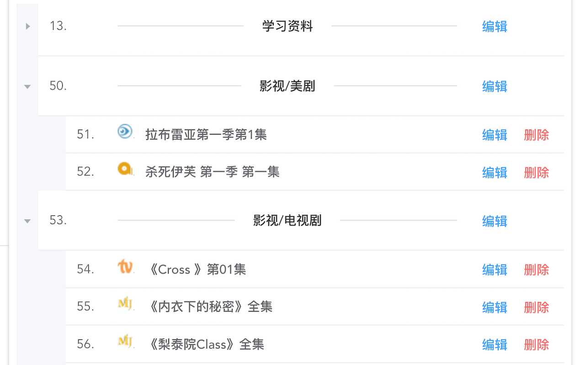
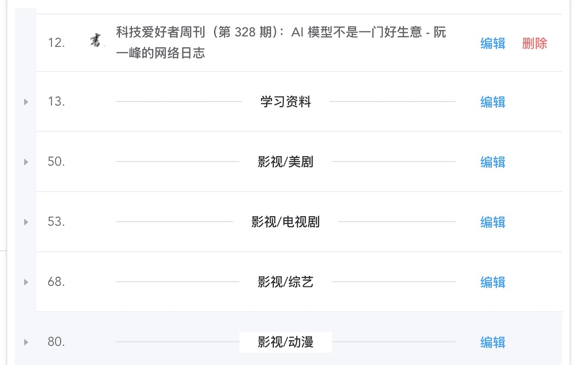
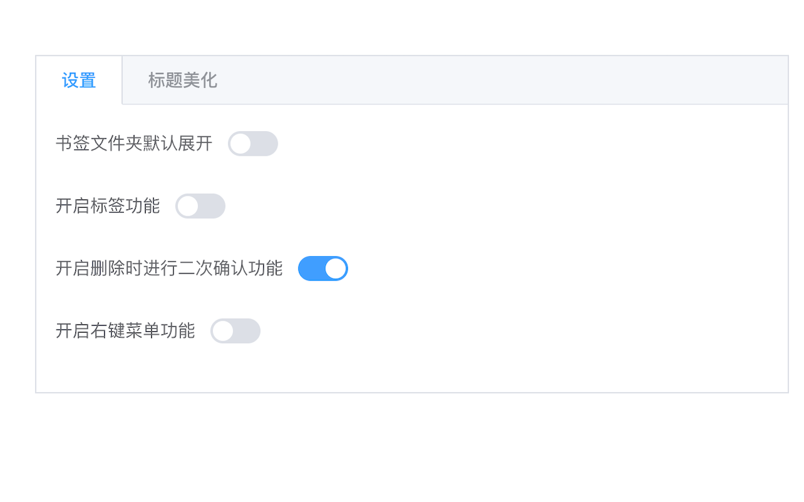
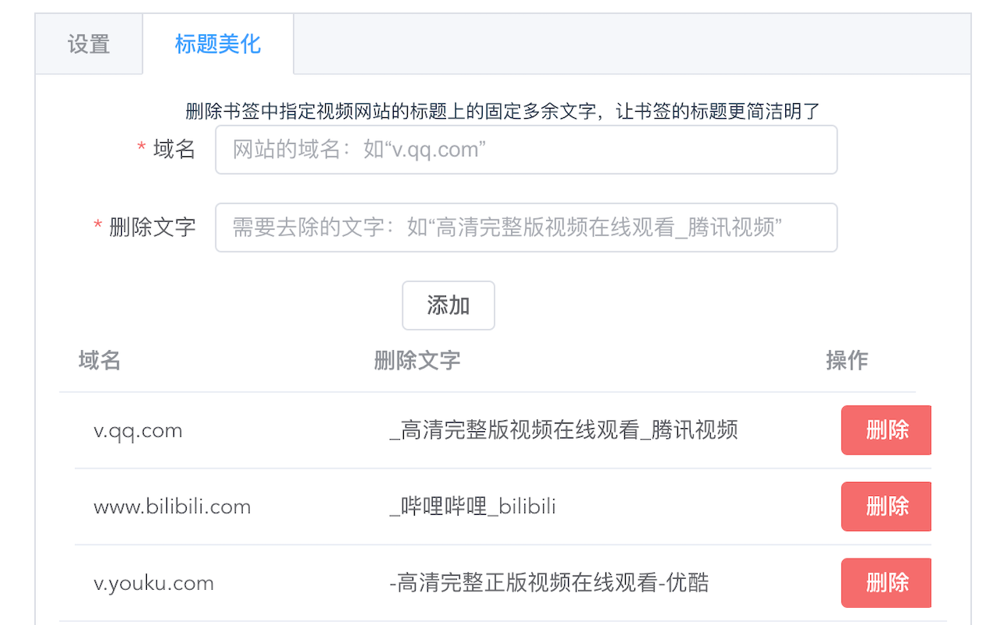

  

  
  

## 项目简介

在互联网发展迅速的今天，在线观看电视剧、综艺剧、番剧已成为一种趋势。保存视频的观看进度已然成为一种需求。
**追剧助手**是一款专为追剧爱好者设计的浏览器扩展程序，它能帮助用户轻松管理和保存在线视频的观看进度，支持标签分类、标题美化、快捷操作等功能，让追剧变得更加高效和便捷。

## 功能特性

- **书签管理**：快速添加、编辑、删除和组织你的视频书签
- **标签功能**：为书签添加标签，方便分类和快速查找
- **标题美化**：自动移除标题中的冗余文字，让书签标题更简洁
- **默认展开**：可设置书签列表默认展开，便于快速浏览
- **右键菜单**：通过右键菜单快速添加当前页面到追剧助手（默认关闭）
- **二次确认**：删除书签时进行二次确认，防止误删（默认开启）
- **拖拽排序**：支持书签和文件夹的拖拽排序，自定义管理界面
- **搜索过滤**：快速搜索和过滤书签，轻松找到目标内容
- **数据同步**：利用浏览器同步功能，实现书签数据跨设备同步

## 应用截图

  <table>
    <tr>
      <td align="center">
        
        
弹窗界面 - 轻松管理你的追剧书签

      </td>
      <td align="center">
        
        
选项界面 - 个性化配置你的追剧助手

      </td>
    </tr>
    <tr>
      <td align="center">
        
        
书签管理 - 直观的书签列表和标签功能

      </td>
      <td align="center">
        
        
标题美化 - 自定义规则清理标题冗余文字

      </td>
    </tr>
  </table>

## 安装方式

### 在线安装（推荐）

- **Chrome Web Store**：[追剧助手](https://chrome.google.com/webstore/detail/%E8%BF%BD%E5%89%A7%E5%8A%A9%E6%89%8B/pbnnheibacpamfaendimogbeaeciglpo)
- **Microsoft Edge Add-ons**：[追剧助手](https://microsoftedge.microsoft.com/addons/detail/%E8%BF%BD%E5%89%A7%E5%8A%A9%E6%89%8B/kijikbnlbgddamolcfnlelppffpkkmla)

## 使用说明

### 添加书签
点击扩展图标打开弹窗，点击"添加追剧"按钮或使用右键菜单（需开启）将当前页面添加到书签列表。

### 管理书签
在弹窗中，你可以：
- 编辑书签标题
- 添加标签
- 移动书签到不同文件夹
- 删除书签

### 搜索书签
使用搜索框快速过滤和查找你的书签。

### 访问书签
点击书签即可在新标签页中打开对应的视频页面。

## 配置选项

在扩展的选项页面中，你可以配置以下功能：

- **默认展开**：开启后，书签列表将默认展开显示所有内容
- **标签功能**：开启后，可在书签中添加和管理标签
- **二次确认**：开启后，删除书签时会弹出确认对话框
- **右键菜单**：开启后，可在页面右键菜单中快速添加当前页面到追剧助手
- **标题美化**：在"标题美化"页面中，可配置域名和需要移除的标题文字规则

## 核心功能模块

### 后台脚本 (background.js)
负责书签与标签页的关联管理、右键菜单的动态创建与移除、标签页的监听与更新、以及保活机制。

### 弹窗页面 (PagePopup.vue)
提供用户交互界面，实现书签的增删改查、拖拽排序、标签管理、搜索过滤等功能。

### 选项页面 (PageOptions.vue)
提供配置选项，包括默认展开、标签功能、二次确认、右键菜单开关，以及标签统计和标题美化规则设置。

### 核心辅助类 (helper.js)
封装了书签管理、数据存储、标签页操作、消息通信、配置管理等核心功能类。

## 开发指南

1. **环境准备**：确保已安装Node.js和npm
2. **依赖安装**：在项目根目录下运行 `npm install` 安装开发依赖
3. **开发调试**：使用Chrome开发者模式加载扩展，进行调试和测试
4. **代码规范**：遵循项目现有的代码风格和规范

## 权限说明

- `bookmarks`：用于管理书签
- `storage`：用于存储扩展数据
- `tabs`：用于获取和操作标签页信息
- `contextMenus`：用于创建右键菜单项
- `favicon`：用于获取网站图标

## 版本日志

### v1.2.5
- 修复了一些已知问题，提升了扩展稳定性

### v1.2.4
- 新增右键菜单功能（默认关闭）
- 新增删除二次确认功能（默认开启）
- 添加edge浏览器的支持

### v1.2.3
- 新增标签管理功能
- 新增默认展开配置
- 新增标题文字去除功能

## 贡献指南

欢迎提交Issue和Pull Request来帮助改进追剧助手。

## 常见问题

### 如何同步数据？
扩展使用浏览器的同步功能，只需在浏览器设置中开启同步即可。

### 为什么右键菜单不显示？
请在扩展的选项页面中开启右键菜单功能。

### 如何自定义标题美化规则？
在扩展的选项页面中，找到"标题美化"标签页，可以添加需要移除的标题文字规则。
